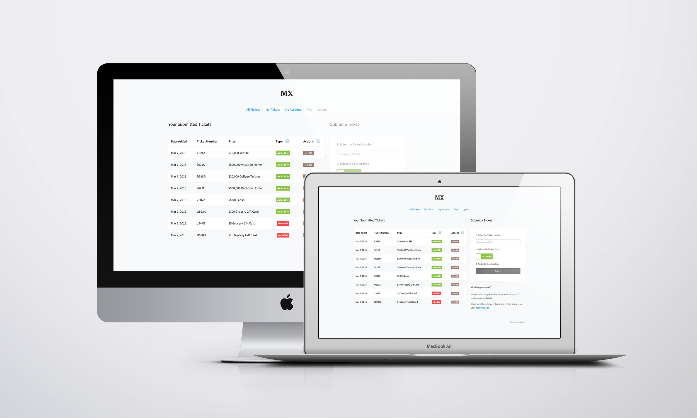
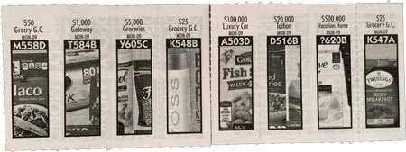

### Monopoly Exchange

This site is for players of the 2016 grocery store Monopoly game. If you're not sure what that is, don't feel bad. It might not be available in your area. For those that are playing, use this site to post and exchange tickets with your fellow gamers.

### Frequently Asked Questions

**Can I use this website for my local grocery store's Monopoly game?**

The following stores are listed on the Monopoly board that this website was designed to support:

Vons, Pavilions, Amigos, Albertsons, Safeway, Acme, Jewel-Osco, Shaws, Albertsons, Carrs, Market Street, United Supermarkets, United Express, Randalls, Tom Thumb, Star Market

**I've found a ticket that I'd like to claim. How do I do that?**

The ticket owner's Facebook page will be linked next to the ticket. Send them a message through Facebook to request the ticket.

**How will I know when a ticket I need becomes available?**

First, make sure that you mark the ticket that you need as "Needed" when you submit it. If another user has entered your ticket as "Available", you'll receive an email alert notifying you.

You'll only receive an email alert if you elect to enter your email address on your account page so make sure that you've done that before entering any tickets.

When you're notified of a match, come back to the directory, locate the ticket that's available, and contact that user through the Facebook profile they've provided.

**Do I have to enter my email address in the account page?**

Not at all. It's completely voluntary. You'll just need to periodically come back and enter the ticket numbers you need in the search form to see if someone has one available.

**Will you add other ways to login besides Facebook?**

Honestly, it doesn't look like that'll happen this time around. This was the best solution to allow for users to connect with each other quickly and it keeps the amount of personal details you need to enter to a bare minimum. It couldn't get any easier.

**I think I found a website bug. Where can I report it?**

All bugs should be entered into the [issues tracker](https://github.com/jamigibbs/monopoly-exchange/issues). And if you're also a developer, pull requests are welcome!

### Disclaimer

This application isn't associated with nor is it endorsed by Monopoly or any of the fab stores listed above.
